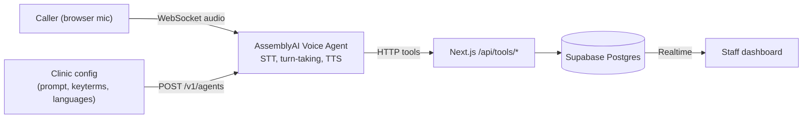

# VoiceDesk: a multilingual voice receptionist for clinics and salons

**Never miss a booking call again, in any language.**
Built for the AssemblyAI Voice Agent Hackathon on the
[AssemblyAI Voice Agent API](https://www.assemblyai.com/docs).

[Live demo]([URL]) · [Demo video]([URL]) · [Slides]([URL]) · [Eval scorecard]([URL]/eval)

## The problem
Small clinics and salons miss calls, close at night, and cannot staff every
language. Every missed call is a lost booking. [Add your sourced statistic.]

## What it does
- Answers in the caller's language and follows mid-call language switches
  (English, Spanish, Hindi. [update to what you support]).
- Books, reschedules, and cancels appointments with a real database.
- Reads back names, dates, times and phone numbers before confirming.
- Answers clinic FAQs only from the clinic's own data (no guessing).
- Hands off to a human with a callback ticket when unsure or on emergencies.
- Live staff dashboard with transcripts, tool calls, and outcomes.
- **Built-in eval harness:** 30 scripted calls with a public scorecard.

## Accuracy results
| Metric | Result |
|---|---|
| Task success | [X%] |
| Entity accuracy (name/date/time/phone) | [X%] |
| Correct tool calls | [X%] |
| Read-back before booking | [X%] |
| Correct reply language | [X%] |
| p50 / p95 first-reply latency | [X s / Y s] |

Full case-by-case results: `/eval`. We report failures too.

## Architecture


## How we use AssemblyAI
| Feature | Where | File |
|---|---|---|
| Voice Agent API (STT, TTS, turn-taking, barge-in) | live call | `src/lib/voice/client.ts` |
| Agent provisioning (prompt, greeting, voice) | setup | `scripts/provision.ts` |
| HTTP tools (JSON schema) | booking, FAQ, handoff | `src/app/api/tools/*` |
| Keyterms from clinic data | accuracy | `scripts/provision.ts` |
| Multilingual `language_codes` + native voices | multilingual | `scripts/provision.ts` |
| Single-use session token | security | `src/app/api/session/route.ts` |
[Adjust paths and features to match your code.]

## Quick start
```bash
git clone [repo] && cd voicedesk
cp .env.example .env.local        # fill in keys
npm install
npm run db:migrate && npm run db:seed
npm run provision                 # creates the AssemblyAI agent
npm run dev
```
AssemblyAI calls your tool endpoints from the internet, so use a public HTTPS
URL (Vercel deploy or an HTTPS tunnel). `localhost` will not work for tools.
Run `npm run doctor` to check config, agent, and tool reachability.

## Environment variables
`ASSEMBLYAI_API_KEY`, `SUPABASE_URL`, `SUPABASE_SERVICE_KEY`,
`NEXT_PUBLIC_SUPABASE_URL`, `NEXT_PUBLIC_SUPABASE_ANON_KEY`, `TOOL_SECRET`,
`PUBLIC_BASE_URL`

## Run the eval
```bash
npm run eval          # streams 30 audio cases through the real agent
```

## Safety and privacy
- API keys never reach the browser (single-use session tokens).
- Tool endpoints require a secret header and validate all input.
- Phone numbers are masked in logs.
- The agent gives no medical advice and routes emergencies to [emergency number].

## Roadmap
Real phone numbers (Twilio), Google Calendar sync, SMS confirmations,
more languages, multi-clinic onboarding UI.

## License
MIT. See [LICENSE](LICENSE).
